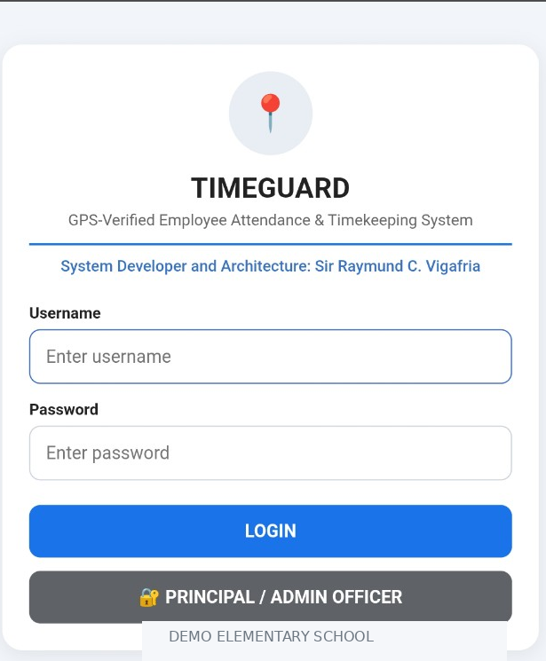
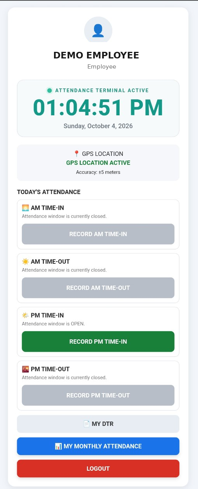
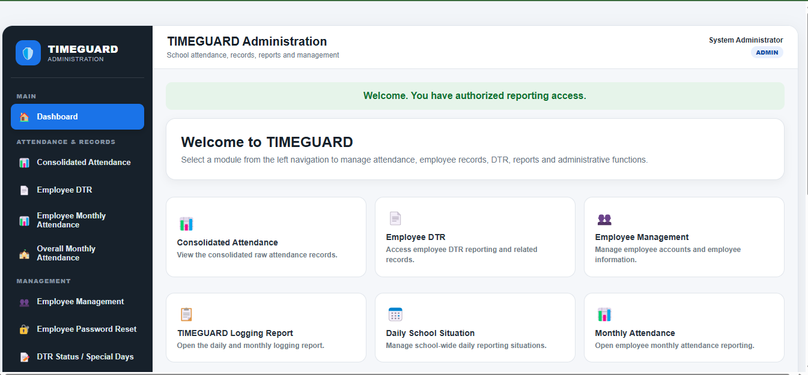
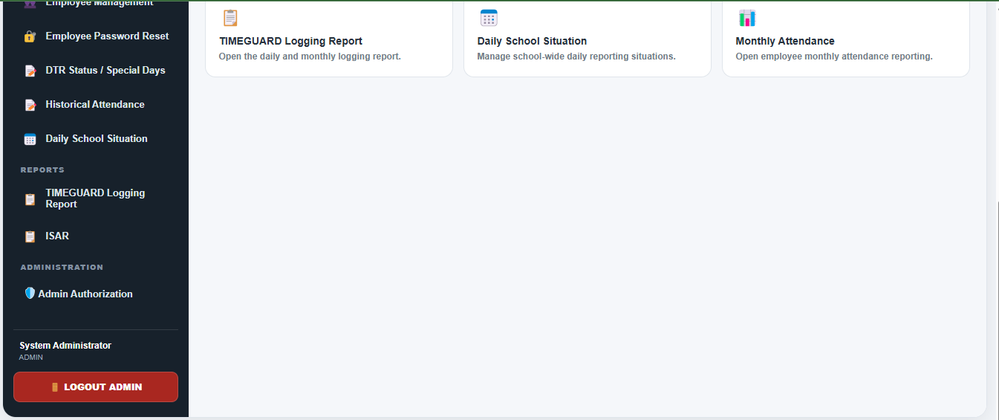

# timeguard-gps-attendance-system
GPS-based employee attendance and monitoring system designed for schools, featuring location-verified time-in/time-out, attendance tracking, and administrative reporting.
# TIMEGUARD
## GPS-Based Employee Attendance and Monitoring System

TIMEGUARD is a GPS-based employee attendance and monitoring system designed for schools.

It was developed to address common problems associated with manual attendance recording, including handwritten logsheets, discrepancies between attendance records and Daily Time Records (DTR), missing or inconsistent entries, and the administrative burden of manually preparing attendance documents.

TIMEGUARD uses location-verified attendance recording to help ensure that employees record their time-in and time-out within the authorized school location.

---

## The Problem

Traditional attendance processes may require employees to:

- Write their attendance manually on logsheets
- Record time entries in multiple documents
- Prepare or copy information into their DTR
- Correct discrepancies between different attendance records
- Depend on administrators to manually verify attendance
- Physically monitor attendance activities

These processes can result in:

- Inconsistent attendance records
- Errors and omissions
- Duplicate data entry
- Discrepancies between logsheets, raw attendance data, and DTR
- Additional administrative workload
- Difficulty monitoring attendance in real time

TIMEGUARD was developed as a digital solution to these problems.

---

## The TIMEGUARD Approach

TIMEGUARD establishes a centralized attendance record from which attendance-related outputs can be generated.

### Employee

1. Employee logs into TIMEGUARD.
2. The system verifies the employee's location.
3. Attendance can be recorded within the authorized school campus.
4. Time-in and time-out transactions are recorded digitally.
5. Attendance data becomes part of the employee's official attendance record.

### Administrator

The administrator can monitor employee attendance through an administrative interface without needing to physically monitor every attendance transaction.

The system provides a centralized view of attendance records and employee time entries.

---

## Key Features

### GPS-Based Attendance Verification

TIMEGUARD uses location information to verify that attendance transactions are made within the authorized school area.

### Digital Time-In and Time-Out

Employees can record their attendance digitally without manually writing their time entries on a paper logsheet.

### Automated Attendance Records

Attendance transactions are automatically stored and organized by the system.

### Automated DTR Generation

The system can automatically generate the employee's Daily Time Record (DTR).

The generated DTR can be sent to the employee's registered email address for:

1. Printing
2. Signing
3. Submission

This eliminates the need to manually prepare the DTR from separate attendance records.

### Centralized Attendance Monitoring

Administrators can monitor employee attendance through the TIMEGUARD administrative interface.

### Consistent Attendance Data

TIMEGUARD is designed so that the attendance transaction becomes the common source of data for attendance-related records and reports.

This helps prevent discrepancies between:

- Digital attendance logs
- Raw attendance data
- Logsheet records
- Generated DTR

### ISAR Integration

TIMEGUARD includes an integrated ISAR component to support administrative monitoring and school-level assessment/reporting requirements.

---

## Data Flow

```text
             EMPLOYEE
                 |
                 v
          TIMEGUARD LOGIN
                 |
                 v
       LOCATION VERIFICATION
                 |
                 v
        TIME-IN / TIME-OUT
                 |
                 v
       CENTRAL ATTENDANCE DATA
                 |
       +---------+---------+
       |         |         |
       v         v         v
    LOGSHEET   RAW DATA   DTR
                           |
                           v
                    EMPLOYEE EMAIL
                           |
                           v
                   PRINT / SIGN / SUBMIT

```

---

## System Screenshots

The following screenshots demonstrate selected interfaces of the TIMEGUARD system using sanitized demo data.

### 1. Employee Login



### 2. Employee Attendance Dashboard



### 3. Administrative Dashboard



### 4. Administrative Reporting Modules



> **Note:** Screenshots use demonstration data and do not represent actual employee attendance records or confidential institutional information.
